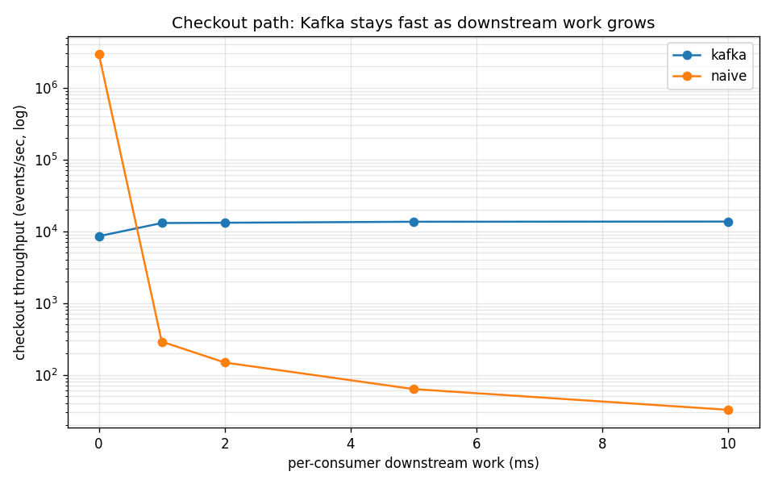
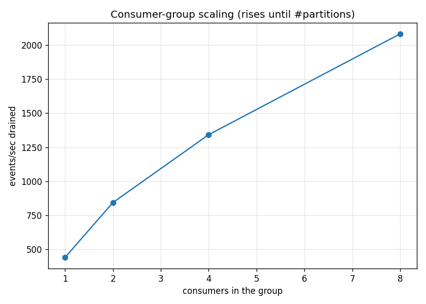

<h1 align="center">kafka-load-leveling</h1>

<p align="center">
  A fast service shouldn't be held hostage by slow downstream work.<br>
  How <a href="https://kafka.apache.org" title="Apache Kafka — a durable, partitioned commit log">Kafka</a>
  levels load by decoupling a fast producer from slow, spiky, or flaky consumers.
</p>

<p align="center"><sub><b>No Docker — just Java + Python.</b></sub></p>

---

Concrete case: an online store's **checkout**. Each order must update
**inventory**, send a **confirmation email**, and update **analytics**. The
obvious design runs all of that *inside the checkout request*. This repo builds
it that way, shows where it breaks, then fixes it with Kafka — and measures it.

### At a glance

| Situation | Without Kafka | With Kafka |
|---|---|---|
| Downstream work gets slow | checkout collapses (≈290 → 30/s) | flat ≈ 13,000/s |
| A consumer crashes | events lost | **0 loss** (replays from offset) |
| Add consumers | — | 1→8 consumers: 440 → 2,083/s |
| A broker dies | data lost | **0 loss** (replication-factor 3) |

## Contents

1. [The problem](#the-problem)
2. [Alternatives](#alternatives)
3. [How Kafka helps](#how-kafka-helps)
4. Demos — [load leveling](#load-leveling) · [durability](#durability) · [consumer-group scaling](#consumer-group-scaling) · [broker failover](#broker-failover)
5. [Run it](#run-it)
6. [Watch it live (web UI)](#watch-it-live-web-ui)
7. [Real-world caveats](#real-world-caveats)

## The problem

```
checkout()  ->  update_inventory()  ->  send_email()  ->  update_analytics()  ->  return
```

Checkout is as slow as the **sum** of everything downstream. A spike or one
slow/failing service backs up the front-end; a crash mid-request drops events;
adding a consumer means editing checkout. Classic **queue-based load leveling**.

## Alternatives

| Approach | Pros | Cons |
|---|---|---|
| **Direct calls** (sync HTTP/RPC) | simplest, no infra | front-end blocked by the slowest/failing consumer; no spike buffering; lost on crash; no replay |
| **DB table as a queue** (poll) | durable, transactional | polling latency; lock contention at scale; you hand-build offsets, retention, fan-out |
| **In-memory queue** | trivial, decouples in-process | lost on restart; single process; no durability or replay |
| **RabbitMQ** / classic MQ | great routing, mature, backpressure | consumed once — not a replayable log; weaker retention/replay |
| **Redis Streams / pub-sub** | lightweight, fast | pub/sub drops with no subscriber; memory-bound; smaller ecosystem |
| **Kafka** | durable log absorbs spikes; replay; independent consumer groups; scales | heavier to operate; overkill when small |

## How Kafka helps

```
checkout()  ->  publish("orders", event)  ->  return        (fast, durable append)
                       │  Kafka buffers the spike
        ┌──────────────┼──────────────┐
   inventory         email         analytics                 (drain at their own pace)
```

Checkout returns after **one durable append** — its latency no longer depends on
downstream speed. Each demo below measures one property.

---

## Load leveling

Checkout throughput as downstream work grows — inline (naive) vs Kafka. Naive
collapses (it runs the work inline); Kafka stays flat (just appends and returns).

<p align="center">
  <br>
  
</p>

```bash
python src/demo.py throughput
```

## Durability

Crash a consumer mid-stream and restart it. Kafka resumes from its committed
offset → **0 loss**; an in-memory queue loses what it hadn't processed.

<p align="center"></p>

```bash
python src/demo.py durability
```

## Consumer-group scaling

One topic with 12 partitions, one consumer group; add consumers and throughput
rises, up to the partition count (each join triggers a rebalance).

<p align="center">
  <br>
  
</p>

```bash
python src/demo.py scaling
```

## Broker failover

A `replication-factor=3` topic survives a broker dying. One command starts a
3-broker cluster, produces, kills a broker mid-stream, and shows 0 loss.

<p align="center"></p>

```bash
./scripts/failover.sh            # 3 brokers on 9092/9094/9096; kills one
./scripts/cluster.sh stop        # when done
```

---

## Run it

```bash
sudo apt-get install -y default-jre   # Kafka is a Java process
./scripts/run.sh                      # start Kafka, set up a venv, run load-leveling + durability
./scripts/kafka.sh stop               # stop the broker
```

`scripts/kafka.sh` downloads a single-broker Kafka (KRaft, no ZooKeeper) to
`~/.local` and runs it in the background. GIFs are rendered from `tapes/*.tape`
with [VHS](https://github.com/charmbracelet/vhs): `vhs tapes/<demo>.tape`.

## Watch it live (web UI)

In another terminal run `./scripts/ui.sh` (a standalone jar, no Docker), then open
**http://localhost:8080** to watch topics, messages, and **consumer-group lag**
build and drain while a demo runs.

## Real-world caveats

- **Partitions cap parallelism** — consumers in a group split the partitions, so
  consumer count scales throughput only up to the partition count (hard to change later).
- **Ordering is per-partition**, not global — key your messages to keep per-key order.
- **Replication** (`acks=all` + `min.insync.replicas` + RF≥3) is what survives a
  broker loss; `acks=1` can lose data on failover.
- **Rebalances pause the group**, and default delivery is **at-least-once** — the
  demos dedupe by `order_id`.

> [!NOTE]
> Single broker / `replication-factor=1` for the load-leveling & durability demos;
> scaling and failover use 12 partitions and a 3-broker cluster. A local setup, not production.
